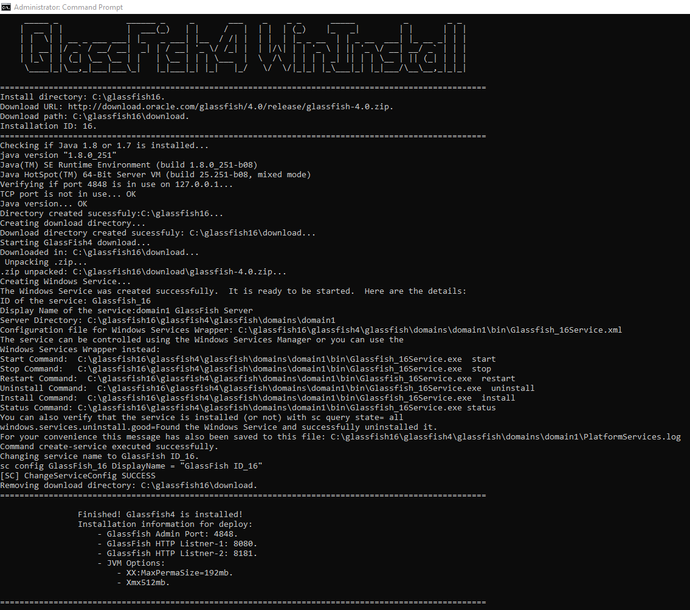

# __glassfish-winstall__

### Objective/Objetivo:
Automate the installation of GlassFish on a Windows computer / Automatizar a instalação do GlassFish em um computador com Windows.

### Why? Por quê?
In my previous job, every new employee I had to manually install on their PCs / Em meu emprego anterior, a cada novo colaborador eu tinha que instalar manualmente em seus PCs.

### Use example/Exemplo de uso:

 

### Task Lists:
_EN:_
- [x] Install Glassfish4 with default settings.
- [x] Check if the TCP ports are in use.
- [x] Check if Java is installed correctly.
- [x] Use Oracle's standard GlassFish4.
- [ ] Allow to use a .zip with a customized GlassFish.
- [ ] Allow to define installation directory.
- [ ] Allow to define domain.xml ports and settings.
- [ ] Create an Executable so that it is not necessary to download Python.

_PT-BR:_
- [x] Instalar o Glassfish4 com as configurações padrão.
- [x] Verificar se as portas TCP estão em uso.
- [x] Vericar se o Java está instalado corretamente.
- [x] Utilizar GlassFish4 padrão da Oracle.
- [ ] Permitir utilizar um .zip com um GlassFish customizado.
- [ ] Permitir definir diretório de instalação.
- [ ] Permitir definir portas e configurações do domain.xml.
- [ ] Criar um Executável para que não seja necessário baixar o Python.

### Requirements:
1. Java 1.8 or 1.7.
2. Python 3.7+.

### How to use:
1. Download file or clone repository / Baixe ou clone o repositório.
2. Execute CMD with adminstrative previleges / Execute o CMD com previlégios de Administrador.
3. Run in CMD: python winstall.py(Must be in the same directory as winstall.py) / Execute no CMD: python winstall.py(Precisa estar no mesmo diretório de winstall.py).
